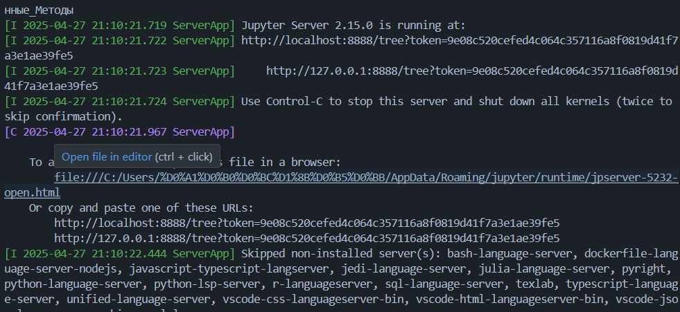
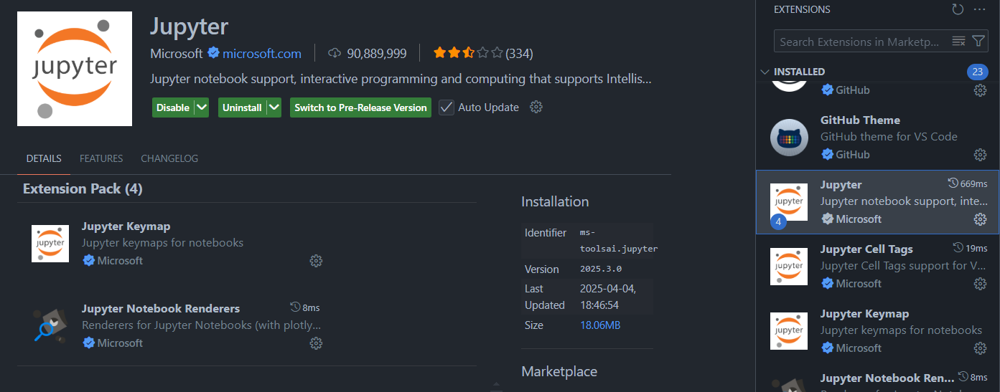
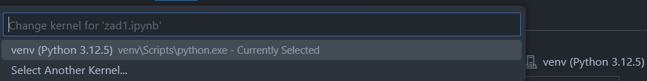

# Для запуска программы

<strong>⚠️ Warning:</strong> В коде много дерьма и отсутствуют комментарии. Разбирайтесь сами. 

<strong>⚠️ Warning:</strong> Не все программы дописаны. Конкретнее не работает 3 и не неписано 9

## Установка необходимых библиотек

1) В консоли прописать команду `python -m venv venv` и дождаться её выполнения
2) В той же консоли прописать `venv/Scripts/activate`
3) Последняя команда `pip intsall -r requirements.txt` и дождаться её выполнения 

Опционально: Если не хочется устанавливать расширение для VS Code или вы пользуетесь другим редактором
прописать в консоли `jupyter notebook`(Ctrl+C для завершения). Далее, зажав клавишу Ctrl перейти по ссылке

## Установка расширения для VS Code

В окне поиска расширений(Ctrl+Shift+X) найти расширение Jupyter и установить его

Выбрать интерпритатор, если не выбран

## Работа с ячейками 

1) Enter (когда выбрана ячейка) - перейти в режим редактирования
2) Ctrl+Enter - запустить код в ячейке
3) Esc (в режиме редактирования) - выйти из режима редактирования
4) В (вне режима редактирования) - вставить пустую ячейку ниже
5) А (вне режима редактирования) - вставить пустую ячейку выше
6) DD (вне режима редактирования) - удалить ячейку